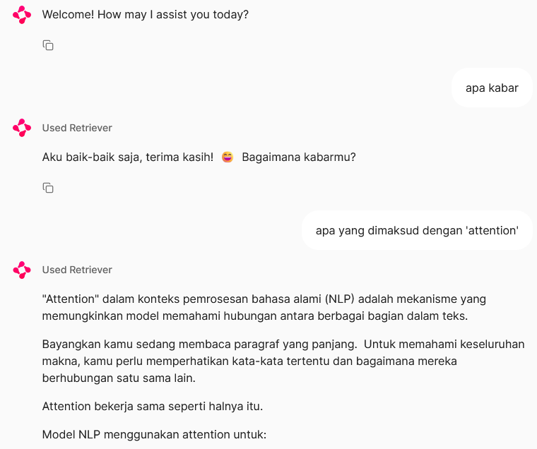

# Fully Local (sort of) Implementation of RAG Chatbot

tech stack: Ollama, Langchain, Chainlit, LlamaParse, ChromaDB, Hugging Face

## Features
1. Retrieval Augmented Generation (of course)
2. Memory (chatbot remembers previous conversations in the same session)
3. Streaming answers
4. Local vector database (ChromaDB)

## How to run

### Setting up Ollama
1. Install Ollama (refer to their official site) and pull your choice of LLM. Here I am using Gemma 2 9B
2. Set environment variable `OLLAMA_HOST` to 0.0.0.0 (in Windows, using powershell: $env:OLLAMA_HOST="0.0.0.0")
3. Serve the model using `ollama serve`

### Running the chatbot
1. Install dependencies (requirements.txt)
2. Get LlamaIndex API key (it is free) and put it in .env
3. Ingest files in the `data` folder with **knowledgebase.ipynb**
4. Run the chatbot using `chainlit run rag.py`

# Sneak peek

